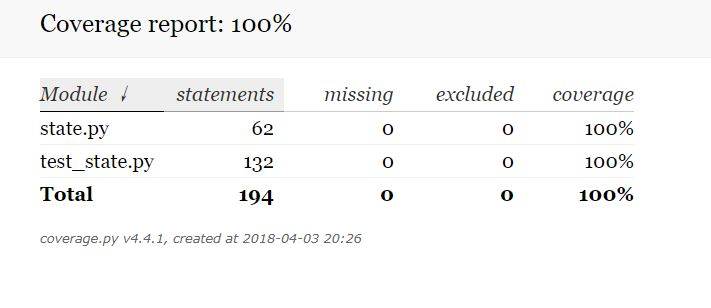
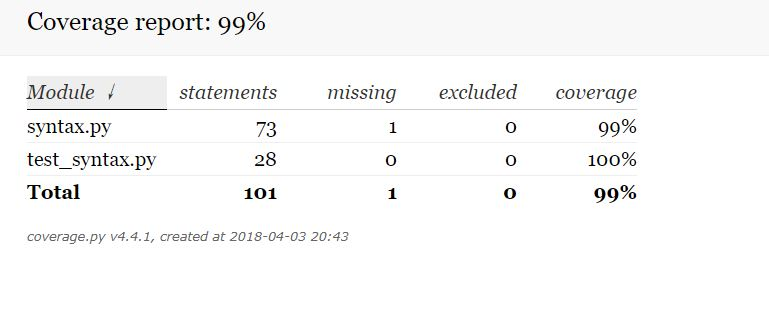
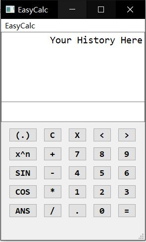
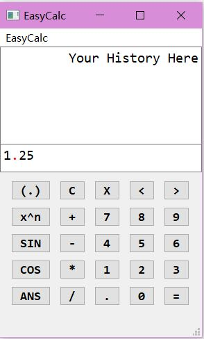

## 测试概要

| 项目名称 | 测试人员 | 测试进度 | 测试时间 | 文档编写时间 |
|---------|--------|---------|---------|------------|
| EasyCal | 康子涵、苏文治、许如清 | 全部完成 | 2018.4.3 | 2018.4.3 |

### 测试内容：

- 代码测试：
	+ 代码规范
	+ 模块单元测试
- 使用测试：
	+ 安装
	+ 界面展示
	+ 按钮功能

## 代码规范

程序遵循PEP8代码规范。未发现较大问题。

## state模块测试

 - ### 单元测试：

| 测试函数 | 测试输入序列 | 测试结果 | 发现问题 | 原因 | 修改 |
|---------|-----------|---------|---------|-----|------|
| inputNumber | 1 3 | 通过 | 无 | 无 | 无 |
| inputDot | 0 dot C 6 dot | 通过 | 无 | 无 | 无 |
| inputOperator | 1 * | 通过 | 无 | 无 | 无 |
| inputFunction |  1 3 * sin | 通过 | 无 | 无 | 无 |
| inputBrackets | 1 3 brackets 5 | 通过 | 无 | 无 | 无 |
| inputLastAnswer| ans | 通过 | 无 | 无 | 无 |
| backspace | 3 dot 8 B B B sin B brackets 3 move+ B B B B | 未通过 | 删除左括号的时候未将右括号同步删除 | 从存储字符的list中删除内容时少删了一个字符 | 调整del的第二个参数 |
| allClear | 6 C | 通过 | 无 | 无 | 无 |
| movePointer | move+ move- cos move+ move+ move- move- move- move- | 通过 | 无 | 无 | 无 |
| resetWithAns | 4 resetWithAns | 通过 | 无 | 无 | 无 |

- ### 代码覆盖：

测试代码覆盖了state的所有函数，使用coverage库检查，state文件代码覆盖率为100%

## syntax模块测试
 - ### 单元测试：

| 测试函数 | 测试输入序列 | 测试结果 | 发现问题 | 原因 | 修改 |
|---------|-----------|---------|---------|-----|------|
| SyntaxCheck | ['2','+','-', '3'] | 未通过 | -3未能识别 | 负号没有作为单独的词法单元处理 | 程序构造“factor”中增加负号语法 |
| SyntaxCheck | ['sin','sin','23345'] | 未通过 | sin后应有括号，未查出错 | sin与负号同样处理 | 将sin与cos单独处理 |
| SyntaxCheck | ['235','/','(','3'] | 通过 | 无 | 无 | 无 |
| SyntaxCheck | ['5.23', '+', '2'] | 通过 | 无 | 无 | 无 |
| SyntaxCheck | e5 = ['2','+','(','-','3',')'] | 通过 | 无 | 无 | 无 |
| SyntaxCheck | ['5.23', '+', '2'] | 通过 | 无 | 无 | 无 |
| SyntaxCheck | ['52','*','6','^','(','cos','(', 'sin','3',')', ')'] | 通过 | 无 | 无 | 无 |
| SyntaxCheck | ['1','+','+','+','2'] | 通过 | 无 | 无 | 无 |
| SyntaxCheck | ['1', '+', 'sin', '(', '2', ')', '-', '5434', '^', '(', 'sin', '(', 'cos', '(',  '32', '*', '3', '/', '5',')',')',')'] | 通过 | 无 | 无 | 无 |

- ### 代码覆盖：
测试覆盖了syntax的所有函数，99%的代码。未覆盖代码经过仔细检查后认为有可能是死代码，但慎重起见予以保留。

## 使用测试

- ### 安装

	程序运行需要python环境和pyqt5模块  
	pip install pyqt5  
	git clone https://github.com/52Hzihan/calculator.git  
	cd calculator  
	python core.py  

- ### 界面展示

- ### 按钮功能测试

| 测试按键 | 测试结果 | 发现问题 | 原因 | 修改 |
|----------|---------|---------|-----|------|
|c| 通过 |无|无|无|
|x| 通过 |无|无|无|
|<| 通过 |无|无|无|
|>| 通过 |无|无|无|
|x^n| 通过 |无|无|无|
|+| 通过 |无|无|无|
|-| 通过 |无|无|无|
|*| 通过 |无|无|无|
|=| 未通过 |空输入时按‘=’会崩溃|laout模块中没有做接收空list的处理|增加代码，空list时直接return|
|1| 通过 |无|无|无|
|2| 通过 |无|无|无|
|3| 通过 |无|无|无|
|4| 通过 |无|无|无|
|5| 通过 |无|无|无|
|6| 通过 |无|无|无|
|7| 通过 |无|无|无|
|8| 通过 |无|无|无|
|9| 通过 |无|无|无|
|0| 通过 |无|无|无|
|ans| 通过 |无|无|无|
|.| 未通过 |浮点数无法正确计算，会在‘.’处报错|词法分析时忽略了‘.’|增加词法分析选项|

浮点bug：  

